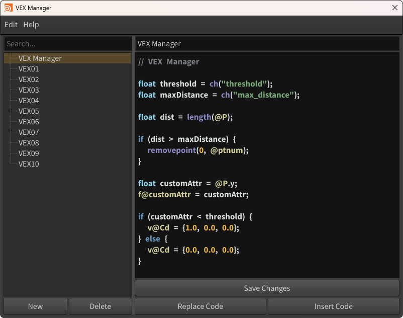

# vex-manager
VEX Manager is a tool for Houdini that saves, manages, and imports VEX code presets across projects.



## Table of Contents
- [Installation](#installation)
- [Shelf Button Creation](#shelf-button-creation)

## Installation
1. Download the project:
   - Click the `<> Code` button on GitHub
   - Select the `Download ZIP` option to download the compressed file
2. Extract the ZIP file:
   - Extract the downloaded ZIP file
3. Move the files to Houdini's `packages` folder:
   - Copy the `vex-manager-master` folder into Houdini's `packages` directory
   - Inside the `vex-manager-master` folder, copy the `vex-manager.json` file and place it directly into Houdini's `packages` directory
        - On Windows `C:\Users\<YourUsername>\Documents\Houdini<version>\packages` 
        - On macOs `~/Documents/Houdini<version>/packages`
4. Rename the folder:
   - Rename the `vex-manager-master` folder to `vex-manager`

## Shelf Button Creation
1. In the Houdini interface, go to the **Shelf** area
2. **Right-click** on an empty space in the Shelf and select **New Tool...**
3. In the **Edit tool** window, in the **Script** section, copy the following Python code
    ```python  
   from vex_manager import VEXManagerUI
   
   vex_manager_ui = VEXManagerUI()
   vex_manager_ui.show()
    ```
4. Click **Accept** to save the new button on the Shelf
